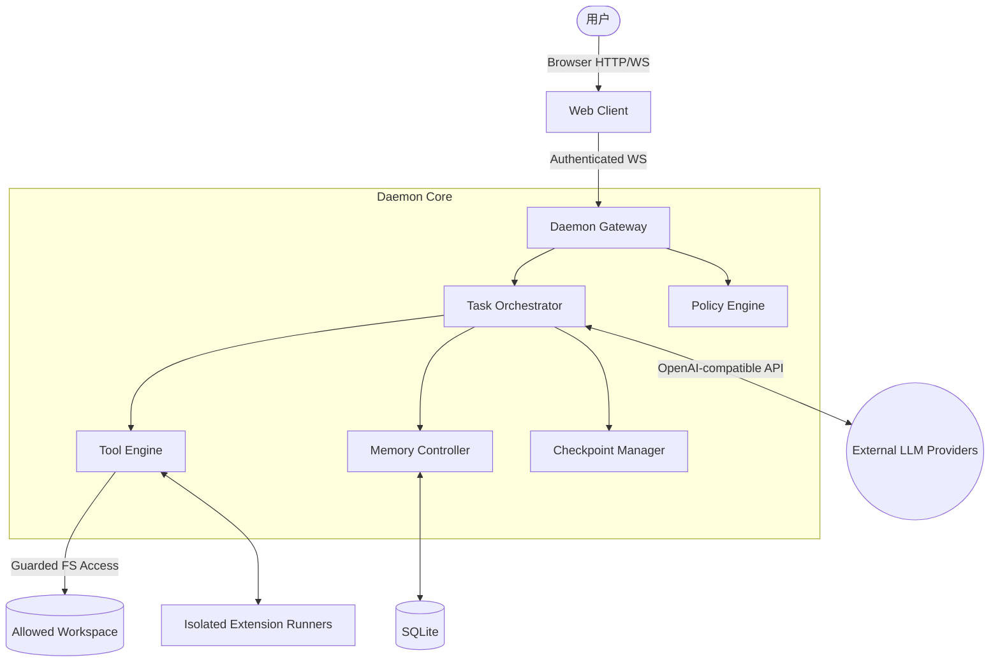

# AhaAgent 技术系统设计文档（修订版）

> 实现状态说明（2026-03-13）：
> 本文档同时描述“当前实现”和“目标态设计”。未特别说明时，请优先将其视为设计目标而非已全部交付。
> 当前仓库已实现的主干能力包括：WS 网关鉴权、任务状态机、审批 nonce、防重放、基础文件/命令工具、Web 搜索与抓取、浏览器自动化基础能力、SQLite 记忆、上下文压缩、基础扩展安装器与隔离 Runner。
> 当前未完全实现或未闭环的能力包括：Daemon 重启后的 checkpoint 自动恢复、扩展/MCP 的完整安装授权调用链、文档中描述的完整队列/锁/回滚体系、严格意义上的“协议全链路验收”。

## 1. 架构总览

AhaAgent 采用 **C/S 架构**，核心技术栈统一为 **Node.js + TypeScript**。系统由以下运行单元组成：

1.  **Daemon Core（主控进程）**：任务编排、协议网关、策略引擎、审计。
2.  **Web Client（前端界面）**：聊天交互、审批、任务状态展示。
3.  **Extension Runner（隔离扩展运行时）**：仅运行已安装并授权的扩展/MCP Server。
4.  **Local Storage（本地持久化）**：SQLite + 文件目录（检查点、记忆、日志索引、扩展元数据）。

### 1.1 拓扑图



## 2. 安全基线与信任边界

### 2.1 信任分层

- **可信层**：Daemon Core 自身代码、用户显式配置。
- **半可信层**：用户项目代码与本地技能文件。
- **不可信层**：外部模型输出、第三方扩展、网络输入。

### 2.2 安全默认值

- 默认禁止写入、删除、执行命令、安装扩展。
- 默认禁止把敏感数据发送到外部模型。
- 默认禁止未授权扩展被加载到可执行态。

### 2.3 威胁模型（V1 必须覆盖）

1.  本地端口被恶意网页调用。
2.  扩展供应链投毒与恶意代码执行。
3.  路径穿越/符号链接逃逸/并发竞态导致越权读写。
4.  审批重放或重复提交导致重复执行。
5.  日志、记忆、上下文中的敏感信息外泄。

## 3. 核心模块详细设计

### 3.1 LLM Router

- 统一封装多供应商 API，接口保持 OpenAI-compatible。
- 内置 `max_retries`、指数退避、上下文压缩。
- 所有模型请求附带 `traceId`，并记录 token 消耗与耗时指标。
- 支持执行模式：
  - `interactive`：工具审批按标准流程执行。
  - `autonomous`：对 `write_file/delete_file/run_command` 可自动放行（硬拒绝规则仍生效）。

> 当前状态：已基础实现。`traceId` 已透传，重试与上下文压缩已落地；更细粒度的指标观测仍偏简化。

### 3.2 Policy Engine（新增核心）

Policy Engine 是所有高风险能力的强制前置网关。

- **输入**：`actor`（user/assistant/extension）、`action`、`resource`、`context`。
- **输出**：`allow` / `deny` / `require_approval`。
- **管控对象**：
  - 文件权限：read/write/delete。
  - 命令执行权限：允许命令白名单、参数规则。
  - 网络外发权限：是否允许把内容发送给外部 LLM/扩展。
  - 扩展权限：声明权限是否匹配用户授权。

### 3.3 Tool Engine 与文件沙箱

#### 3.3.1 路径与句柄安全策略

- 允许目录由 `allowed_workspaces` 明确声明。
- 执行流程：
  1.  对输入路径做 `path.resolve`。
  2.  对目标路径做 `realpath`，与工作区 `realpath` 比较前缀边界。
  3.  拒绝跨工作区访问、拒绝危险路径模式。
  4.  打开文件后再次 `fstat` 校验，减少 TOCTOU 风险。
- 对符号链接、路径穿越、相对路径越权统一拒绝。

> 当前状态：已部分实现。当前代码已覆盖 `resolve/realpath`、工作区边界校验和敏感路径拦截；“打开文件后再次 `fstat` 校验，减少 TOCTOU 风险” 仍未见落地实现。

#### 3.3.2 数据外发与脱敏

- 文件读取分级：`public` / `restricted` / `secret`。
- `secret` 内容禁止出现在模型输入、日志、记忆。
- `restricted` 必须先脱敏再可外发。
- 默认敏感规则：`.env*`, `*.pem`, `*.key`, `id_rsa*`, `.ssh/*`, `.npmrc`, `secrets.*`。

#### 3.3.3 精准改动

- 采用 Search-and-Replace / AST patch，禁止整文件盲改。
- 写入时要求携带 `expectedVersion`（文件版本号），不匹配则拒绝并触发“重读-重规划”。

> 当前状态：部分实现。`diff_edit` 已支持 `expectedVersion`；`write_file` 现已在覆盖已有文件时强制要求 `expectedVersion`，但“冲突后自动重读-重规划”仍未形成完整闭环。

#### 3.3.4 Web 与浏览器工具

- Web 读取链路：`browser_search` -> `fetch_url/browser_open` -> `extract_main_content`。
- 浏览器自动化链路：统一入口 `browser_tool(action=...)`，支持 `start/status/search/open/click_result/click/type/snapshot/stop`。
- 工具执行策略：
  - 用户只输入自然语言，不暴露工具勾选开关。
  - LLM 按 `toolChoice=auto` 决定是否调用工具。
  - 工具结果回写到同一推理循环中继续决策。
- 浏览器模式：
  - 默认本地可见浏览器（`AHA_BROWSER_HEADLESS=0`）。
  - 可通过 `AHA_BROWSER_CDP_URL` 连接外部 CDP 浏览器会话。
- 安全约束：浏览器导航仅允许 `http/https`，并阻断 localhost/内网地址，防止 SSRF。

> 当前状态：已基础实现。URL 安全校验、DuckDuckGo 搜索、HTML 抓取、Playwright 浏览器操作均已落地；复杂站点流程成功率和健壮性仍受站点策略影响。

### 3.4 任务状态机与并发控制

#### 3.4.1 状态机

`idle -> planning -> running -> awaiting_approval -> running -> success/failed/cancelled`

补充：

- `interactive`：完整经过 `awaiting_approval` 分支。
- `autonomous`：满足自动放行条件时可跳过 `awaiting_approval`，直接执行工具并继续循环。

#### 3.4.2 队列与锁

- `ReadQueue` 可并发。
- `MutationQueue` 串行提交。
- 文件级锁 + TTL，超时自动清理。
- 锁冲突时返回 `conflict`，由编排器决定重试或失败。
- 执行预算：
  - `maxSteps` 限制循环步数。
  - `maxWrites` 限制写动作次数。
  - `maxCommands` 限制命令执行次数。
  - 任一超限会终止任务并返回可观测错误。

> 当前状态：部分实现。执行预算、基础 mutation queue、文件锁组件已存在；但文中描述的 `ReadQueue`、完整锁冲突恢复策略、统一重试编排尚未看到完整主流程接入。

#### 3.4.3 取消与回滚

- `cancel_task` 触发后：
  - 停止未开始步骤。
  - 中断可中断子进程。
  - 释放文件锁。
  - 把任务标记为 `cancelled` 并记录审计事件。

> 当前状态：部分实现。任务取消与终态回传已实现；对子进程中断、锁释放、回滚语义的完整闭环仍较简化。

### 3.5 记忆系统

Agent 通过 `memory_search` / `memory_store` 两个工具自主决定读写记忆，无需用户手动管理。

> 当前状态：已基础实现。SQLite 持久化、FTS/LIKE 混合搜索、淘汰策略、上下文压缩已落地；非文本语义召回和更细粒度权限治理尚未实现。

#### 3.5.1 存储

- **长期记忆**：SQLite `memories` 表，字段包含 `content/category/sensitivity/access_count/last_accessed_at`。
- **FTS 索引**：`memories_fts` 虚拟表（FTS5 trigram），英文查询使用 BM25 排序召回。
- **会话历史**：以 `conversationId` 为键的内存 Map，同一对话内消息自动累积，LLM 可看到完整上下文。

#### 3.5.2 中文搜索

FTS5 trigram 分词器对中文 2 字词（如"喜欢"、"牛肉"）存在字节边界错位问题。采用混合策略：

- **CJK 查询**：检测到中日韩字符后，使用 `@node-rs/jieba` 分词引擎将查询切分为有意义的词语（如"喜欢吃什么" → ["喜欢", "吃"]），然后通过 SQL `LIKE` 子串匹配，OR 逻辑取并集。
- **非 CJK 查询**：使用 FTS5 MATCH + BM25 排序（原有路径）。
- **停用词过滤**：中文虚词（的、了、是、在、什么、怎么等）自动过滤，避免噪音匹配。

#### 3.5.3 召回与安全

- **召回策略**：仅召回非敏感（排除 `secret`，`restricted` 需显式开启）且相关的记忆，TopK 可配置。
- **淘汰策略**：`valueScore = accessCount / (daysSinceLastAccess + 1)`，超过上限时淘汰最低分记忆。
- 命中记忆自动更新 `access_count` 和 `last_accessed_at`。

#### 3.5.4 上下文压缩（Context Manager）

- **Token 估算**：使用 tiktoken（`o200k_base` 编码）精确计算消息 token 数。
- **Memory Flush**（75% 阈值）：注入隐式对话让 Agent 将重要信息存入长期记忆。
- **Compaction**（80% 阈值）：将旧消息用 LLM 总结为摘要，保留最近 4 轮对话不压缩。

#### 3.5.5 环境变量

| 变量 | 默认值 | 说明 |
|------|--------|------|
| `AHA_CONTEXT_WINDOW` | `128000` | 上下文窗口 token 上限 |
| `AHA_MEMORY_MAX_ENTRIES` | `500` | 记忆条目上限 |

### 3.6 扩展系统（MCP）

#### 3.6.1 安装流程（强制）

1.  用户触发安装（CLI/UI），LLM 仅可建议。
2.  校验来源白名单。
3.  校验 `manifest + checksum + signature`。
4.  提取权限声明并展示审批。
5.  安装到 `~/.aha/extensions/`。
6.  在隔离 Runner 中启动并做健康检查。
7.  成功后注册到工具目录；失败则回滚。

> 当前状态：未完全实现。当前仓库已有 `ExtensionInstaller` 与 `ExtensionRunner` 基础代码和测试，但“来源白名单校验 + manifest/checksum/signature + 授权审批 + 工具目录注册 + 失败回滚”的完整链路未全部接入主流程。

#### 3.6.2 运行隔离（关键）

- 不在主进程 `require()` 不可信扩展。
- 每个扩展在独立进程/容器中运行，配置 CPU/内存/超时限制。
- 扩展默认无文件系统和网络权限，按声明最小授权。
- 运行时崩溃只影响该扩展，不影响 Daemon Core。

> 当前状态：部分实现。独立子进程 Runner 已实现；更严格的 CPU/内存/超时/权限隔离仍主要停留在设计目标。

### 3.7 日志与审计

- 结构化日志：`traceId`, `taskId`, `requestId`, `actor`, `action`, `result`。
- 文件：`aha-info.log`、`aha-error.log`、`aha-audit.log`。
- 日志落盘前统一脱敏，禁止记录明文密钥与完整敏感内容。
- 审计日志用于追踪审批、执行、取消、失败原因。
- 运行时进度日志输出到终端：`task_created`、`llm_step_done`、`tool_call`、`tool_result`、`task_terminal`。

## 4. 协议与通信

### 4.1 连接鉴权

- CLI 启动时生成一次性 `sessionToken`，仅当前会话有效。
- WebSocket 握手必须携带 `sessionToken`。
- 服务端强校验 `Origin`、`Host`、`sessionToken`。
- token 过期需重新登录本地会话。

### 4.2 消息信封（统一）

```typescript
interface WsEnvelope<T> {
  protocolVersion: '1.0';
  sessionId: string;
  requestId: string; // 每次请求唯一
  idempotencyKey: string; // 用于重试去重
  timestamp: string; // ISO8601
  payload: T;
}
```

### 4.3 核心事件

- `Client -> Server`
  - `send_message`
  - `approve_action`
  - `cancel_task`
- `Server -> Client`
  - `stream_chunk`
  - `task_status_change`
  - `action_blocked`
  - `task_terminal`（success/failed/cancelled）

### 4.4 审批事件防重放

`action_blocked` 响应中必须包含：

- `approvalId`
- `approvalNonce`（一次性）
- `expiresAt`
- `riskLevel`
- `permissionScope`

`approve_action` 必须带回 `approvalId + approvalNonce`，服务端校验一次后立即失效。

## 5. 关键数据结构

### 5.1 任务模型

```typescript
interface TaskNode {
  id: string;
  parentId?: string;
  title: string;
  status: 'pending' | 'running' | 'blocked' | 'success' | 'failed' | 'cancelled';
  errorCode?: string;
  errorMessage?: string;
  children?: TaskNode[];
}
```

### 5.2 审批模型

```typescript
interface ApprovalRequest {
  approvalId: string;
  taskId: string;
  actionType: 'write_file' | 'delete_file' | 'run_command' | 'install_extension';
  target: string;
  diffPreview?: string;
  riskLevel: 'medium' | 'high' | 'critical';
  nonce: string;
  expiresAt: string;
  scope: {
    workspace: string;
    maxActions: number;
    timeoutSec: number;
  };
}
```

### 5.3 检查点模型

```typescript
interface Checkpoint {
  checkpointId: string;
  taskId: string;
  stepId: string;
  llmContextRef: string;
  pendingApprovalId?: string;
  createdAt: string;
}
```

## 6. 启动生命周期

1.  执行 `node packages/server/dist/cli.js [workspace]`。
2.  解析 `workspace_path` 并计算 `workspaceRealPath`。
3.  启动 HTTP/WS 服务，生成会话级 `sessionToken`。
4.  初始化 SQLite、记忆索引、策略引擎。
5.  扫描扩展目录，仅加载已安装且已启用扩展的元数据。
6.  为每个已启用扩展启动隔离 Runner 并做健康检查。
7.  前端通过 `http://localhost:<port>` 获取 token，并建立认证后的 WS 会话。

> 当前状态：部分实现。数据库、记忆、网关启动与前端取 token 已落地；扩展扫描、自动启动已启用扩展、重启恢复 checkpoint 等流程尚未完全打通。

## 7. 实施优先级（建议）

1.  先实现安全和协议骨架：鉴权、审批 nonce、幂等键、文件沙箱。
2.  再实现任务状态机：队列、锁、取消、检查点恢复。
3.  最后接入扩展生态：安装校验链、隔离 Runner、权限声明。

## 8. 配套规范引用

1.  《协议契约与错误码规范（V1）》：字段级协议、工具契约、错误码字典。
2.  《PolicyEngine 决策表（V1）》：`allow/deny/require_approval` 判定矩阵。
3.  《验收测试与 CI 门禁（V1）》：P0/P1 用例与合并门禁。

---

_文档更新记录：2026-03-06，新增记忆系统详细设计（jieba 分词、对话历史、上下文压缩）。_
